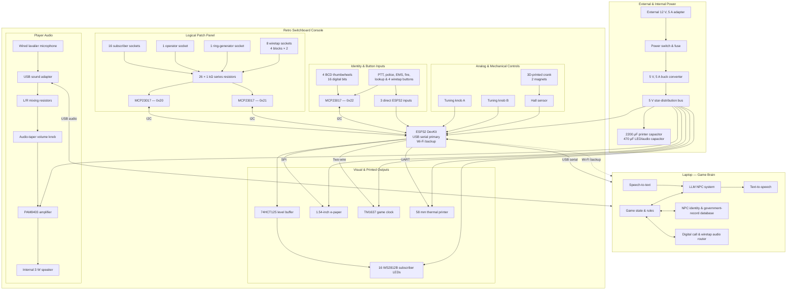

# TODO

## Hardware

### Unit Tests

- [ ] Common
  - [ ] {BUY}
    - [ ] 1x - Main microcontroller (ESP32 DevKit, 38-pin, CP2102)
    - [ ] 1x - Breadboard / Perfboard
    - [ ] 1x - USB Micro-B cable (data-capable)
    - [ ] 1x - Hook-up wire & jumper wire pack
    - [ ] 1x - 12 V, 5 A power adapter
    - [ ] 1x - 12 V to 5 V, 5 A buck converter
    - [ ] 1x - Panel DC socket & inline fuse holder (3 A fuse)
    - [ ] 1x - DPST panel rocker switch
- [ ] Patch panel pair detection
  - [ ] {TEST}: Microcontroller detects when 2 patch ports are connected/wired via I2C expander scan
  - [ ] {BUY}
    - [ ] 1x - I/O Expander (MCP23017)
    - [ ] 2x - 1 kΩ resistor (protection)
    - [ ] 2x - 6.35 mm mono TS panel socket
    - [ ] 2x - 6.35 mm mono TS plug
    - [ ] 1m - Flexible patch cable (two-core/shielded audio cable)
- [ ] Subscriber LED status lights
  - [ ] {TEST}: Test addressable RGB LEDs (WS2812B) driven via level shifter buffer
  - [ ] {BUY}
    - [ ] 1x - WS2812B straight LED module / strip (e.g. 8-pixel bar)
    - [ ] 1x - 74HCT125 logic-level buffer
    - [ ] 1x - 330 Ω resistor
    - [ ] 1x - 100 nF decoupling capacitor
    - [ ] 1x - 470 µF capacitor
- [ ] BCD Thumbwheel identity input
  - [ ] {TEST}: Read 4-bit BCD output from thumbwheel digit (0-9) via MCP23017 input lines
  - [ ] {BUY}
    - [ ] 1x - I/O Expander (MCP23017)
    - [ ] 1x - BCD thumbwheel digit switch (MK/KM series, 8421 BCD output)
- [ ] Direct & wiretap pushbuttons input
  - [ ] {TEST}: Read momentary pushbutton state directly via ESP32 GPIO / MCP23017 with pull-ups
  - [ ] {BUY}
    - [ ] 1x - Threaded metal momentary pushbutton (Main control)
    - [ ] 1x - Basic two-pin pushbutton (Wiretap listen)
    - [ ] 1x - 10 kΩ resistor (external pull-up for direct ESP32 input pins)
- [ ] Hand-crank speed/rotation sensing
  - [ ] {TEST}: Measure crank pulse speed and rotation count using Hall-effect sensor and magnets
  - [ ] {BUY}
    - [ ] 1x - A3144 Hall-effect sensor module
    - [ ] 2x - Small neodymium disc magnets
    - [ ] 2x - 608ZZ bearings
    - [ ] 1x - M8 bolt / shaft hardware set
- [ ] Tuning minigame potentiometers
  - [ ] {TEST}: Read dual analog values (coarse frequency & fine phase) via ESP32 ADC pins
  - [ ] {BUY}
    - [ ] 2x - Full-size 10 kΩ linear potentiometer
    - [ ] 2x - Control knobs
- [ ] Audio playback & microphone path
  - [ ] {TEST}: Output laptop audio through volume pot and PAM8403 amp to speaker, and record microphone via USB sound adapter
  - [ ] {BUY}
    - [ ] 1x - USB sound adapter (separate mic & headphone ports)
    - [ ] 1x - GL-119 wired lavalier microphone
    - [ ] 1x - PAM8403 miniature audio amplifier
    - [ ] 1x - 3 W, 8 Ω miniature speaker
    - [ ] 1x - 10 kΩ or 50 kΩ logarithmic volume potentiometer
    - [ ] 2x - 2.2 kΩ mixing resistors
- [ ] E-Paper information display
  - [ ] {TEST}: Display NPC lookup record card over SPI interface
  - [ ] {BUY}
    - [ ] 1x - 1.54-inch 200x200 B/W e-paper display module
- [ ] Game clock display
  - [ ] {TEST}: Receive and display 4-digit game time from laptop over two-wire interface
  - [ ] {BUY}
    - [ ] 1x - Red TM1637 four-digit display module
- [ ] Thermal printer integration
  - [ ] {TEST}: Print text receipts and daily notices via UART interface
  - [ ] {BUY}
    - [ ] 1x - QR701 58 mm embedded thermal printer
    - [ ] 1x - 57/58 mm thermal paper roll
    - [ ] 1x - 1 kΩ resistor (UART signal protection)
    - [ ] 1x - 2200 µF capacitor (power decoupling)

### BOX

- [ ] Measure and design CAD for 3D printing
- [ ] Print enclosure

### Final work

- [ ] {BUY}
  - [ ] 1x - ESP32 DevKit (38-pin, CP2102) main microcontroller
  - [ ] 3x - MCP23017 16-bit I2C I/O expander modules
  - [ ] 26x - 6.35 mm mono TS panel sockets
  - [ ] 16x - 6.35 mm heavy-duty mono TS plugs
  - [ ] 5m - Flexible two-core / shielded patch cable
  - [ ] 2x - Eight-pixel WS2812B straight LED modules (16 subscriber LEDs total)
  - [ ] 1x - 74HCT125 logic-level buffer IC
  - [ ] 30x - 1 kΩ resistors (26x socket protection + 2x audio mix + 1x printer protection + 1x spare)
  - [ ] 2x - 2.2 kΩ resistors
  - [ ] 10x - 10 kΩ pull-up resistors
  - [ ] 1x - 330 Ω resistor
  - [ ] 1x - 100 nF ceramic capacitor
  - [ ] 1x - 470 µF electrolytic capacitor
  - [ ] 1x - 2200 µF electrolytic capacitor
  - [ ] 4x - MK/KM-series 0-9 8421 BCD output thumbwheels
  - [ ] 1x - 1.54-inch 200x200 B/W e-paper display
  - [ ] 1x - QR701 58 mm embedded thermal printer
  - [ ] 5x - 57/58 mm thermal-paper rolls
  - [ ] 1x - Red TM1637 four-digit display module
  - [ ] 1x - A3144 Hall-effect sensor module
  - [ ] 2x - Small neodymium disc magnets
  - [ ] 2x - 608ZZ bearings
  - [ ] 1x - M8 bolt / smooth shaft hardware set (nuts, washers, spacers)
  - [ ] 2x - Full-size 10 kΩ linear potentiometers (Tuning knobs A & B)
  - [ ] 3x - Retro control knobs (2x tuning, 1x volume)
  - [ ] 1x - 10 kΩ or 50 kΩ logarithmic volume potentiometer
  - [ ] 5x - Threaded metal momentary pushbuttons (PTT, Police, EMS, Fire, Lookup)
  - [ ] 4x - Basic two-pin pushbuttons (Wiretap listen buttons)
  - [ ] 1x - DPST panel rocker switch (Main power switch)
  - [ ] 1x - PAM8403 miniature audio amplifier module
  - [ ] 1x - 3 W, 8 Ω miniature speaker
  - [ ] 1x - GL-119 wired lavalier microphone
  - [ ] 1x - Generic USB sound adapter (separate mic and headphone ports)
  - [ ] 1x - 3.5 mm stereo panel socket and male-to-male cable set
  - [ ] 1x - 12 V, 5 A power adapter
  - [ ] 1x - 12 V to 5 V, 5 A buck converter
  - [ ] 1x - Panel DC socket, inline fuse holder and 3 A fuse set
  - [ ] 2x - Large perfboard / veriboard (stripboard) for power distribution & signal routing
  - [ ] 1x - Internal wiring pack (hook-up wire, ribbon cable, screw terminals, JST connectors, headers, heat-shrink, cable ties)
  - [ ] 1x - Data-capable Micro-USB cable (ESP32 to laptop)
  - [ ] 1x - Mechanical mounting pack (M3 screws, standoffs, nuts, washers, heat-set inserts)

## Software

- [ ] Setup
- [ ] Code
  - [ ] Game State Machine
  - [ ] Prompt template for LLM & TTS
  - [ ] LLM output decoder
- [ ] Find best
  - [ ] TTS
  - [ ] LLM
  - [ ] STT (transcriber)
- [ ] Writing (World Building)
  - [ ] Name 16 subscriber ports
  - [ ] Write 20+ different characters
  - [ ] Create multiple endings
  - [ ] Write game trailer script
  - [ ] Write short gameplay demo script (~5 minutes) demonstrating all mechanics
- [ ] Generate dataset for PEFT
- [ ] Fine-tuning using DoRA
- [ ] Integrate w/ hardware
  - [ ] ...
- [ ] Build PC test UI for debugging
