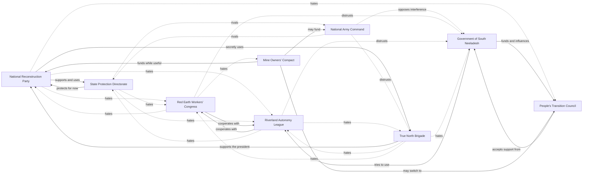

# Faction Relationships

Arrows show how one faction currently treats another. These relationships can change during the game.

```mermaid
flowchart LR
    NRP["National Reconstruction Party"]
    SPD["State Protection Directorate"]
    ARMY["National Army Command"]
    WORKERS["Red Earth Workers' Congress"]
    AUTONOMY["Riverland Autonomy League"]
    TNB["True North Brigade"]
    SOUTH["Government of South Neeladesh"]
    PTC["People's Transition Council"]
    OWNERS["Mine Owners' Compact"]

    NRP -->|"supports and uses"| SPD
    SPD -->|"protects for now"| NRP
    NRP -->|"secretly uses"| TNB
    TNB -->|"supports the president"| NRP

    NRP -.->|"hates"| WORKERS
    NRP -.->|"hates"| AUTONOMY
    NRP -.->|"hates"| PTC

    SPD -.->|"hates"| WORKERS
    SPD -.->|"hates"| AUTONOMY
    SPD -.->|"rivals"| ARMY

    ARMY -.->|"rivals"| SPD
    ARMY -.->|"distrusts"| TNB
    ARMY -.->|"opposes interference"| SOUTH

    WORKERS -->|"cooperates with"| AUTONOMY
    WORKERS -.->|"hates"| NRP
    WORKERS -.->|"hates"| OWNERS
    WORKERS -.->|"distrusts"| SOUTH

    AUTONOMY -->|"cooperates with"| WORKERS
    AUTONOMY -.->|"hates"| TNB
    AUTONOMY -.->|"hates"| SPD
    AUTONOMY -.->|"distrusts"| SOUTH

    TNB -.->|"hates"| AUTONOMY
    TNB -.->|"hates"| WORKERS
    TNB -.->|"hates"| SOUTH

    SOUTH -->|"funds and influences"| PTC
    SOUTH -->|"tries to use"| AUTONOMY
    PTC -->|"accepts support from"| SOUTH

    OWNERS -->|"funds while useful"| NRP
    OWNERS -->|"may fund"| ARMY
    OWNERS -->|"may switch to"| PTC
```
